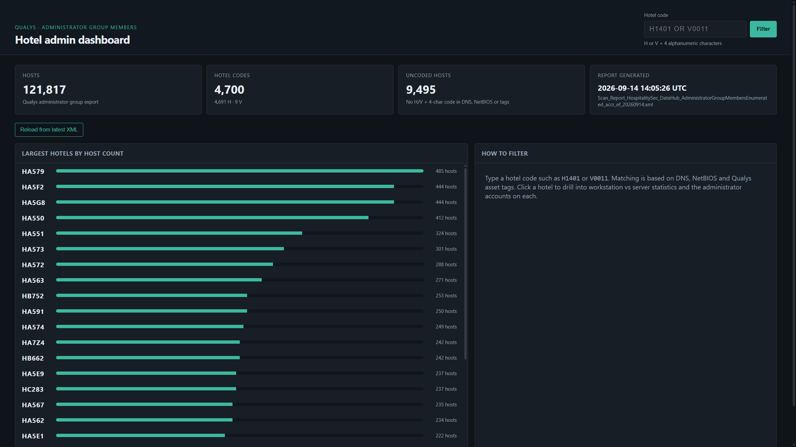
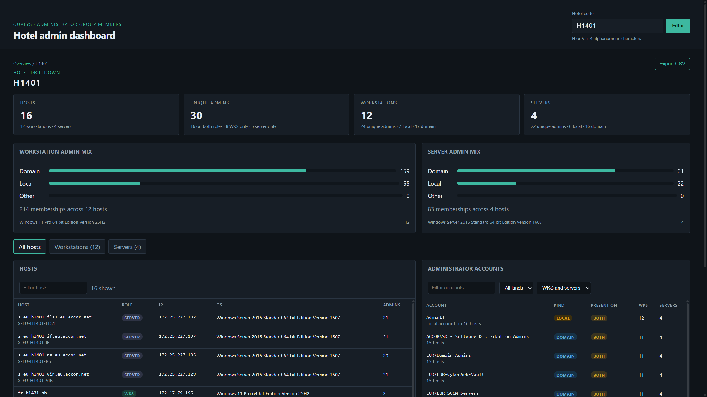
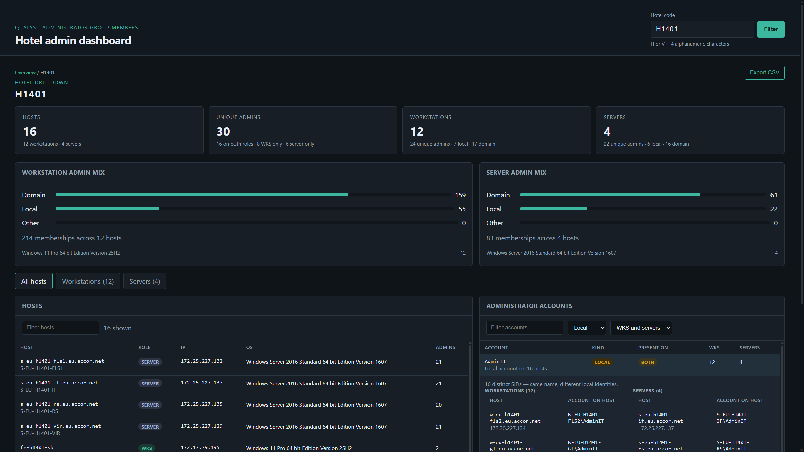

# Hotel administrator dashboard

Local web dashboard for a Qualys **Administrator Group Members** export. It groups hosts from DNS, NetBIOS, and Qualys asset tags and shows who is in the local Administrators group on workstations and servers.

An optional second Qualys export (QID **45437**, filename containing `bitlocker`) adds OS-volume BitLocker status on the same drilldown.

The app listens on **localhost only**. It does not upload the XML.

## Requirements

- **Python 3.10+** (standard library only — no `pip install`, no Node)
- A modern browser
- A Qualys `.xml` administrator asset data report in this folder
- Optionally, a BitLocker `.xml` whose filename contains `bitlocker` (or `bit_locker`)
- About **1 GB RAM** while the server is running, plus disk for the XML (~300 MB) and the generated cache (~150 MB)

## Quick start

1. Put the Qualys XML export(s) in this folder (keep the Qualys filenames).
2. Start the server:

```powershell
python serve.py
```

3. Open [http://127.0.0.1:8765](http://127.0.0.1:8765).

## Screenshots

Overview with inventory totals and the largest sites:



Site drilldown with workstation vs server stats, hosts, and administrator identities:



Local accounts grouped by name, with the hosts where each name is used:



The first run parses the administrator XML into `cache/hosts.pkl` (about 15 seconds for a ~300 MB file) and, if present, the BitLocker XML into `cache/bitlocker.pkl`. Later starts reuse those caches unless a newer XML of that type is present.

## Refreshing the data

Drop new `.xml` files into this folder. The dashboard picks the **newest** file of each type by last-modified time:

- Administrator export: newest `.xml` whose name does **not** contain `bitlocker`
- BitLocker export: newest `.xml` whose name contains `bitlocker` (or `bit_locker`)

Then:

- On the overview page, click **Reload from latest XML** (rebuilds both caches), or
- Rebuild from a terminal, then restart the server:

```powershell
python parse_qualys.py --rebuild
python parse_bitlocker.py --rebuild
python serve.py
```

`python serve.py` also rebuilds a cache automatically if that XML is newer than its pickle (`cache/hosts.pkl` or `cache/bitlocker.pkl`).

## Using the dashboard

- **Filter** the inventory using codes taken from DNS, NetBIOS, and Qualys asset tags. A host belongs to the site in its hostname; leftover tags from another site are ignored.
- Open a **drilldown** for workstation vs server counts, domain vs local mix, host list, and administrator identities.
- Tabs **Workstations** / **Servers** filter both tables.
- **LANPMS** / **Assets** checkboxes (next to those tabs) keep hosts that have this site’s Qualys tag ending in `LANPMS` or `ASSETS`. Both on means no tag restriction. The same filter applies to the host table, the administrator list, and the lateral-movement map. Brand-wide tags such as `*_ALLHOTELS_LANPMS` do not count as this site’s LANPMS.
- **Local** accounts with the same name (for example `AdminIT`) are grouped. Click a row to see every host and the local SAM name (`HOSTNAME\AdminIT`). Distinct SIDs under the same name are called out.
- **BitLocker** (end of the drilldown) reviews the OS volume, usually `C:`. **Unprotected** means the disk is not encrypted. **Protection off** means it is encrypted but BitLocker protectors are disabled (suspended). Unprotected removable drives are listed but not treated as a failure.
- **Lateral movement** (after BitLocker) shows hop-1 / hop-2 / hop-3 reuse of the same local SAM name if an account is compromised. Rotating locals (`Administrator` / `Administrateur`, `AdminDevice`, `AdminIT`) can be excluded. Hosts that are not encrypted, have protection off, or are missing from the BitLocker report are marked as an aggravating factor when a BitLocker export is loaded.
- **Export CSV** downloads per-host memberships for the current filter.

## Layout

```
adminparser/
  serve.py             HTTP dashboard (port 8765)
  parse_qualys.py      administrator XML → cache/hosts.pkl
  parse_bitlocker.py   BitLocker XML → cache/bitlocker.pkl
  web/                 UI
  docs/screenshots/    README images
  cache/               generated pickles — do not commit
  *.xml                Qualys export(s) — do not commit
```

## Notes

- Workstations vs servers is based on the Qualys OS string (`Windows Server` / Hyper-V vs Windows 10/11).
- Domain vs local treats well-known Active Directory domains as domain accounts. Accounts whose domain is the machine name are treated as local.
- The dashboard is not a multi-user service. Stop it with Ctrl+C when you are done.
